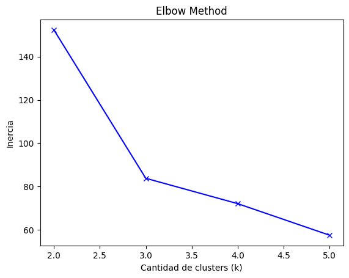
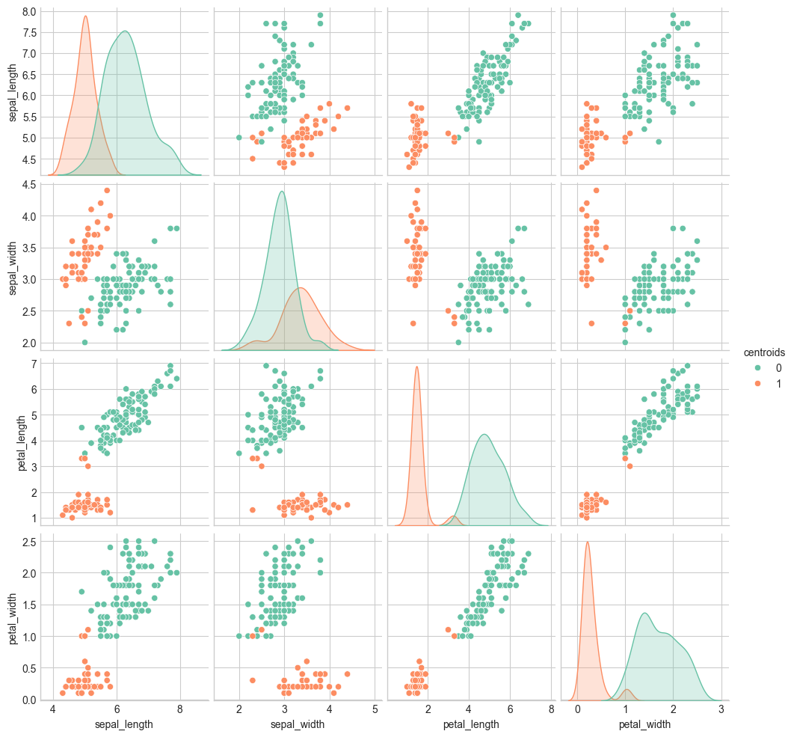
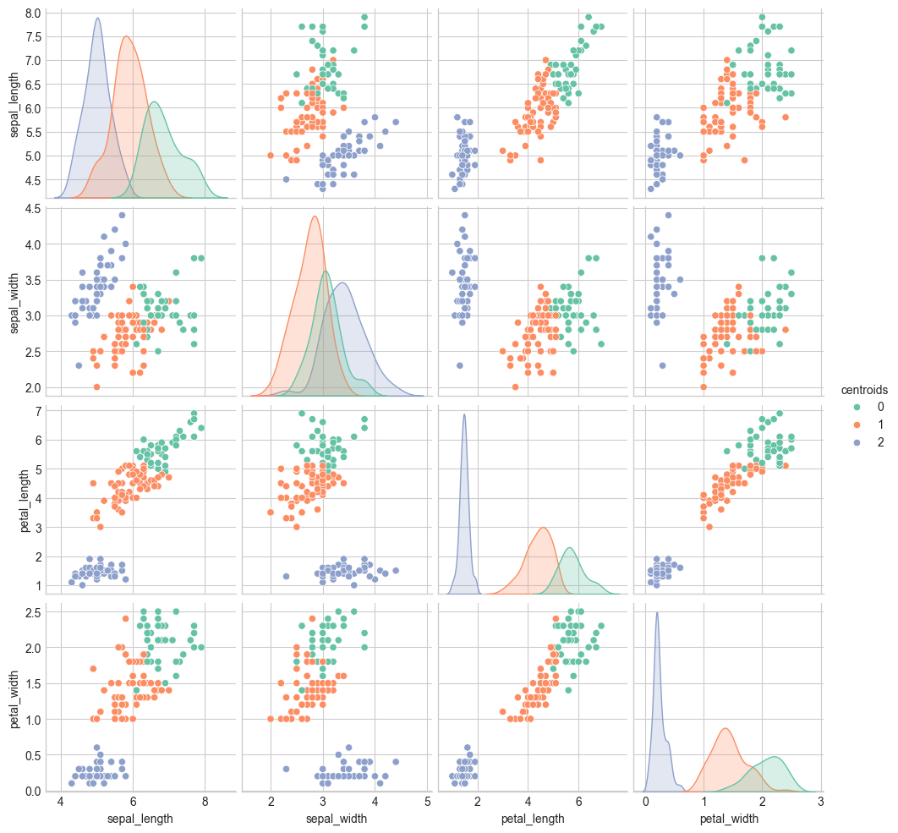
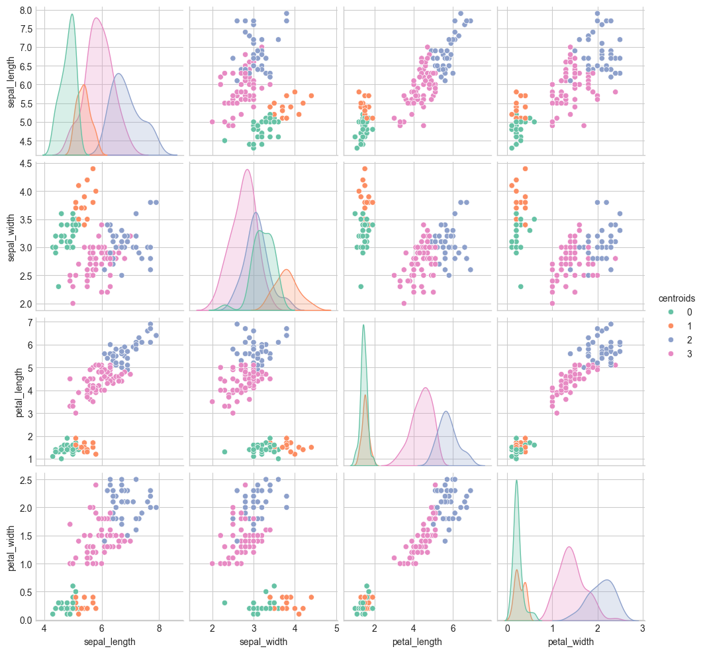
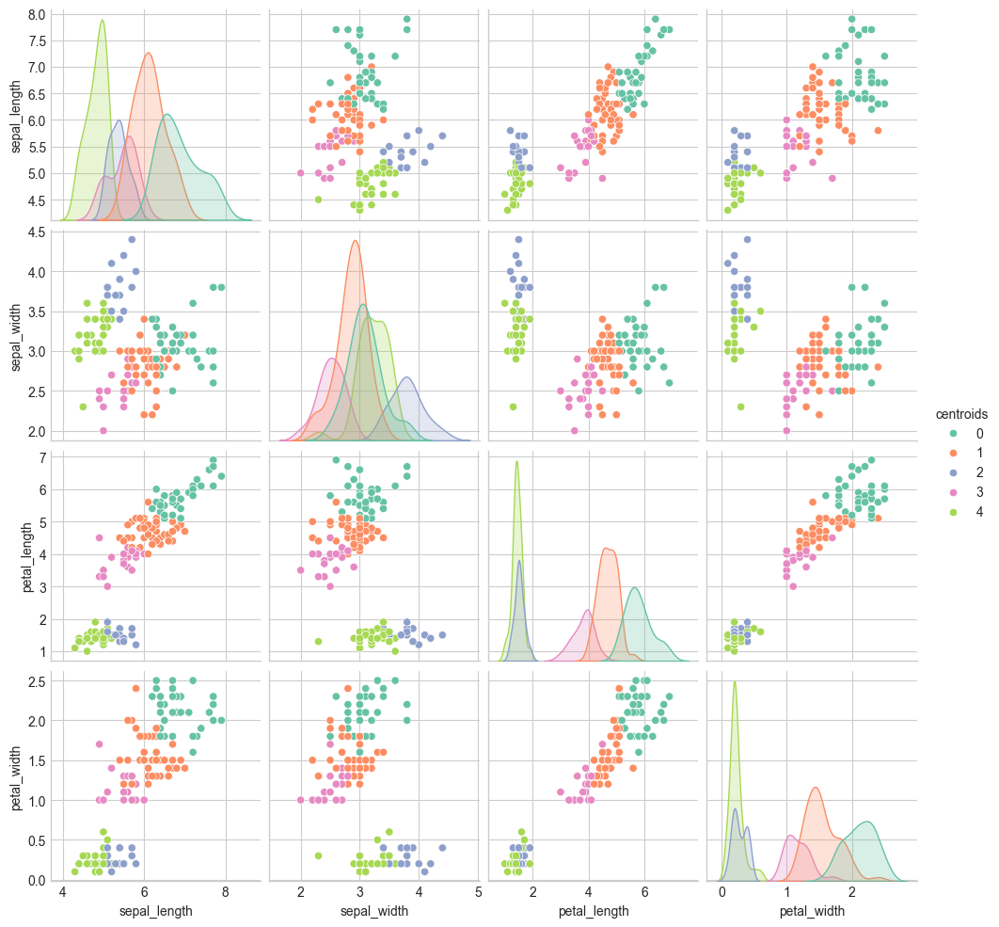
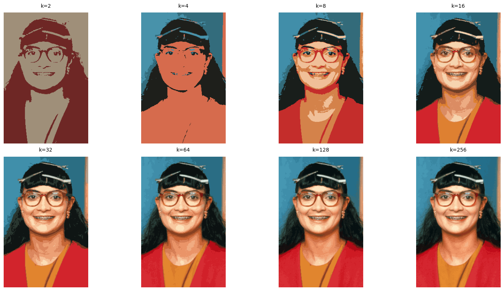
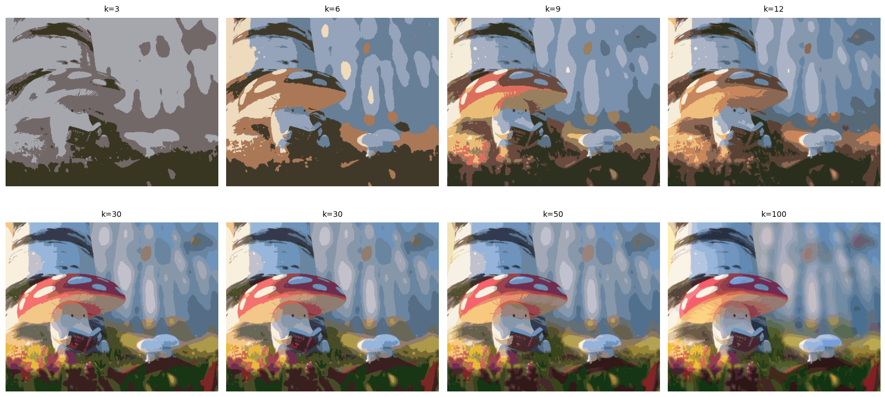
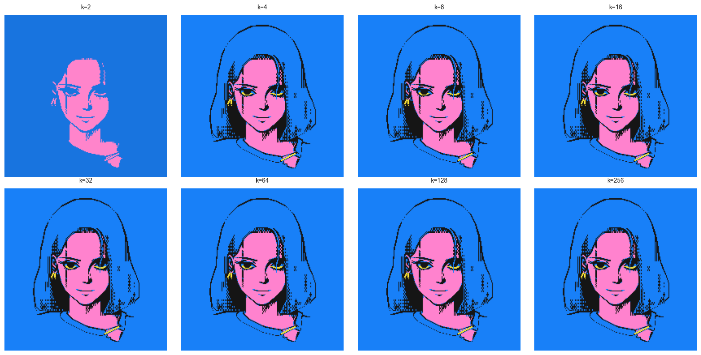

## CI5438 - Proyecto III
## Parte I: Implementación
Se utilizó el algoritmo de *k-means*, el cual tuvo como output un arreglo con el número del cluster al que pertenecía cada uno de los datos de los datasets utilizado.
Asimismo, la implementación también cuenta con fácil acceso al valor de las coordenadas de los centroides de cada uno de los clusters. Esto resultando últil especialmente para la parte III del proyecto.

Para escoger el valor inicial de los centroides, se utilizó un valor aleatorio que estuviese dentro del rango de los valores de los datos utilizados. Esto debido a que escoger valores que no estuviesen contemplados dentro de los datos no traería beneficios al algoritmo. Más bien, se podría ver entorpecido y con necesidad de utilizar un mayor número de iteraciones para llegar a un buen resultado.

En todos los casos mostrados a continuación, se tuvo un máximo de 1000 iteraciones.

## Parte II: Iris Dataset
Tal como en el proyecto previo, se utilizó el *Iris Dataset*, el cual posee 120 muestras catalogadas en: Iris Setosa, Iris Versicolor, Iris Virginica.
Para determinar la categorización de cada una de las muestras, el dataset tiene cuatro parámetros: *sepal length*, *sepal width*, *petal length*, *petal width* o: largo y ancho del sépalo, y largo y ancho del pétalo.

A continuación, podemos ver una distribución de las muestras del dataset combinando dos de los parámetros a la vez:

|  |
|:--:| 
| *Iris Dataset* |

Tal como se observa, *Iris Setosa* es la especie con mayor largo y ancho de pétalo y largo de sépalo. Asimismo, *Iris Virginica* posee los valores más bajos en estas tres categorías pero es aquella con mayor ancho de sépalo.
Mientras tanto, los valores de *Iris Versicolor* se mantienen en el medio de las otras dos especies.

Algo notorio es que los valores de *Iris Versicolor* e *Iris Virginica* se solapan en la mayoría de los plots, mientras que los de *Iris Setosa* viven apartados de ellos. Este solapamiento posiblemente afecte la distribución en *clusters* del dataset.

### Clustering
El dataset se dividió en 2, 3, 4 y 5 clusters. Sin embargo, al hacer el *elbow method* con los resultados obtenidos del algoritmo para cada una de las *k* mencionadas, se determinó que el número ideal de clusters para este dataset es 3.

|  |
|:--:| 
| *Elbow Method* |

A continuación, mostramos los resultados obtenidos por cada una de las *k*:

|  |
|:--:| 
| *K = 2* |

|  |
|:--:| 
| *K = 3* |

|  |
|:--:| 
| *K = 4* |

|  |
|:--:| 
| *K = 5* |

Tal como se vió por el *elbow method*, con *k*=3 se obtienen los valores más parecidos a la división original del dataset. Acá, a pesar de tener algunas clasificaciones erróneas para valores *Iris Versicolor* e *Iris Virginica* -esto producto del solapamiento mencionado anteriormente-, los valores referentes a *Iris Setosa* están bien agrupados.
En el caso de *k*= 4 y *k*=5, se crean agrupamientos innecesarios, mientras que *k*=2 considera los valores de *Iris Versicolor* e *Iris Virginica* como un solo grupo.

## Parte III: Segmentación de Imágenes
Para esta sección, se utilizó Kmeans para segmentar los valores RGB de imágenes y reducirlas a los colores más dominantes dentro de los clusters (los centroides). 

Se utilizaron tres imágenes:
#### Imagen I: Betty

|  |
|:--:| 
| *Imagen original* |

Se fue aumentando el valor de los clusters en una secuencia geométrica (2, 4, 8, ...) hasta llegar a 256 colores que es el tope del rango de los colores RGB. Sin embargo, al tener 32 clusters ya se ve que se han establecido todos los colores base de la imagen. A partir de ahí hasta 256, todo lo que cambia son pequeños grupos de detalles de la imagen.

#### Imagen II: Hongo

|  |
|:--:| 
| *Imagen original* |

Se escogió por la cantidad de diversos colores que posee. Tal como en la imagen pasada, acá a las 30 agrupaciones ya se tiene establecida una imagen concreta con sus colores base.

#### Imagen III: Pixel Art

|  |
|:--:| 
| *Imagen original. [Créditos: @BitBits](https://www.instagram.com/itsbitbits)* |

Se escogió ya que sólo posee cuatro colores, más se deseaba conocer si al tener un *k* mayor al total de los colores, cambiaría de alguna manera el resultado. Podemos ver que no es el caso.

## Conclusiones
*k-means* es un algoritmo bastante fácil y rápido de implementar, así como adaptable a distintos tipos de pruebas y tamaños variados de datasets. Sin embargo, es propenso a ser afectado por valores atípicos. Además, al ser dependiente de un valor de *k* escogido manualmente, puede resultar muy laborioso cuando se requiere probar con distintas cantidades grandes de clusters.